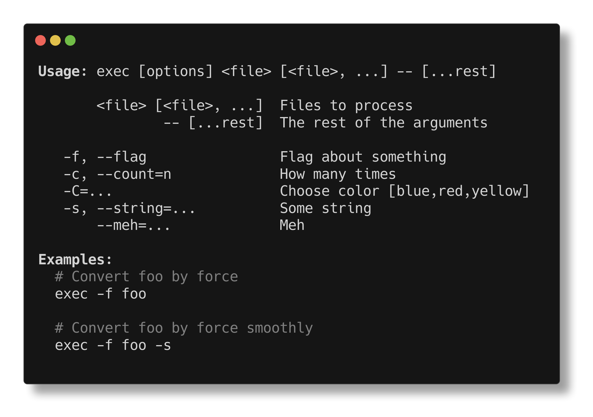

<h1 align="center">decarg</h1>

<p align="center">
decorator based cli arguments parser
</p>

<p align="center">
   <a href="#install">        🔧 <strong>Install</strong></a>
 · <a href="#example">        🧩 <strong>Example</strong></a>
 · <a href="#api">            📜 <strong>API docs</strong></a>
 · <a href="https://github.com/stagas/decarg/releases"> 🔥 <strong>Releases</strong></a>
 · <a href="#contribute">     💪🏼 <strong>Contribute</strong></a>
 · <a href="https://github.com/stagas/decarg/issues">   🖐️ <strong>Help</strong></a>
</p>

***

## Install

```sh
$ npm i decarg
```

## Example

```ts
import { arg, decarg } from 'decarg'

class Options {
  @arg('<file> [<file>, ...]', 'Files to process')
  file!: string[]

  @arg('--', '[...rest]', 'The rest of the arguments')
  passArgs = []

  @arg('-f', '--flag', 'Flag about something')
  flag = false

  @arg('-c', '--count', 'How many times')
  count = 42

  @arg('-C', 'Choose color', ['blue', 'red', 'yellow'])
  color = 'blue'

  @arg('-s', '--string', 'Some string')
  string = 'hmm'

  @arg('--meh', 'Meh')
  meh: string[] = []

  static examples = {
    '-f foo': 'Convert foo by force',
    '-f foo -s': 'Convert foo by force smoothly',
  }
}

const options = decarg(new Options())
```



## API

<!-- Generated by documentation.js. Update this documentation by updating the source code. -->

#### Table of Contents

*   [decarg](#decarg)
    *   [Parameters](#parameters)
*   [parse](#parse)
    *   [Parameters](#parameters-1)
*   [Errors](#errors)
    *   [OptionValidationError](#optionvalidationerror)
    *   [OptionExpectedValueError](#optionexpectedvalueerror)
    *   [OptionInvalidValueError](#optioninvalidvalueerror)
    *   [OptionHelpRequested](#optionhelprequested)

### decarg

[src/index.ts:17-31](https://github.com/stagas/decarg/blob/c0290cbd4a07698637764348c1b7836129a34bfc/src/index.ts#L17-L31 "Source code on GitHub")

Process an options object and handle errors.

#### Parameters

*   `target` **T** The decorated options object.
*   `argv`  Arguments values.&#x20;(optional, default `process.argv.slice(1)`)
*   `overrides` **[Object](https://developer.mozilla.org/docs/Web/JavaScript/Reference/Global_Objects/Object)** &#x20;(optional, default `{}`)

    *   `overrides.exit`  The exit function to use.&#x20;(optional, default `process.exit`)
    *   `overrides.log`  The log function to use.&#x20;(optional, default `console.error`)

Returns **any** The populated options object when successful, otherwise prints help and exits.

### parse

[src/parse.ts:17-81](https://github.com/stagas/decarg/blob/c0290cbd4a07698637764348c1b7836129a34bfc/src/parse.ts#L17-L81 "Source code on GitHub")

Process an options object and throw errors so that they can be
managed manually.

#### Parameters

*   `target` **T** The decorated options object.
*   `argv`  Arguments values.&#x20;(optional, default `process.argv.slice(1)`)

<!---->

*   Throws **any** An AggregateError with [OptionValidationError](#optionvalidationerror) when there are multiple errors
    or an [OptionHelpRequested](#optionhelprequested) error.
    The `.message` property can be printed and is the same as the managed version [decarg](#decarg).

Returns **any** The populated options object when successful, otherwise throws.

### Errors


#### OptionValidationError

[src/errors.ts:8-13](https://github.com/stagas/decarg/blob/c0290cbd4a07698637764348c1b7836129a34bfc/src/errors.ts#L8-L13 "Source code on GitHub")

**Extends Error**

OptionValidationError.

Thrown when the arguments input was somehow invalid.

##### Parameters

*   `message` **[string](https://developer.mozilla.org/docs/Web/JavaScript/Reference/Global_Objects/String)**&#x20;

#### OptionExpectedValueError

[src/errors.ts:20-27](https://github.com/stagas/decarg/blob/c0290cbd4a07698637764348c1b7836129a34bfc/src/errors.ts#L20-L27 "Source code on GitHub")

**Extends OptionValidationError**

OptionExpectedValueError.

Thrown when an argument expects a value and it was not given.

##### Parameters

*   `option` **[Option](https://developer.mozilla.org/docs/Web/API/HTMLOptionElement/Option)\<T>**&#x20;

#### OptionInvalidValueError

[src/errors.ts:35-42](https://github.com/stagas/decarg/blob/c0290cbd4a07698637764348c1b7836129a34bfc/src/errors.ts#L35-L42 "Source code on GitHub")

**Extends OptionValidationError**

OptionInvalidValueError.

Thrown when an invalid option was passed, i.e not in choices when a multiple
choices argument or not a number when a Number argument.

##### Parameters

*   `option` **[Option](https://developer.mozilla.org/docs/Web/API/HTMLOptionElement/Option)\<T>**&#x20;
*   `value` **any**&#x20;

#### OptionHelpRequested

[src/errors.ts:49-54](https://github.com/stagas/decarg/blob/c0290cbd4a07698637764348c1b7836129a34bfc/src/errors.ts#L49-L54 "Source code on GitHub")

**Extends Error**

OptionHelpRequested.

Not an error per se, but thrown anyway when `--help` is passed in the arguments.

##### Parameters

*   `options` **Options\<T>**&#x20;

## Notes

Decorators must be enabled in your TypeScript configuration:

```json
...
  "compilerOptions": {
    ...
    "experimentalDecorators": true,
    "emitDecoratorMetadata": true,
    ...
  }
...
```

## Contribute

[Fork](https://github.com/stagas/decarg/fork) or
[edit](https://github.dev/stagas/decarg) and submit a PR.

All contributions are welcome!

## License

MIT © 2021
[stagas](https://github.com/stagas)
